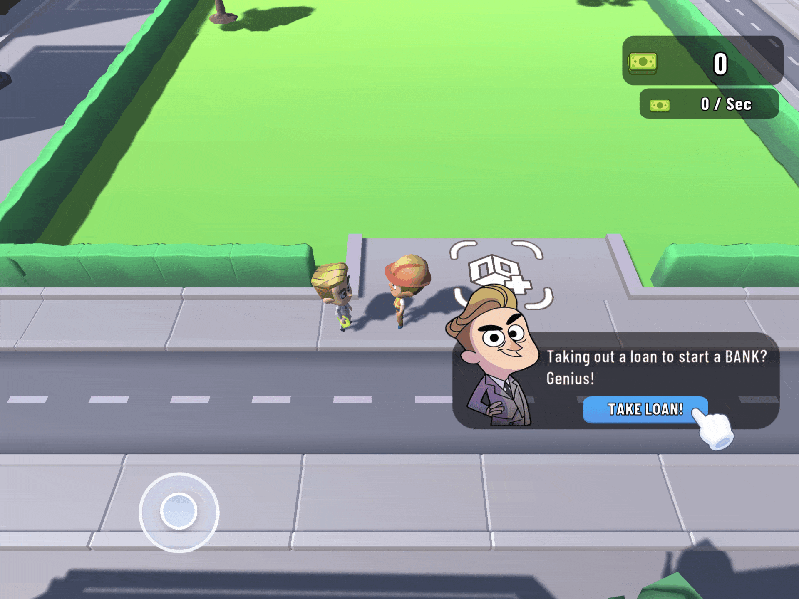

# Unity Playable Ad – Example Project
### *A Playable Ad Prototype using Unity and Luna Playable*

**This is a fully interactive playable ad** built for a trial task, developed using **Unity WebGL and Luna Playable API**. It showcases **engaging gameplay, optimized performance, and smooth UI/UX interactions** within a **lightweight, ad-friendly environment**.

---

## Play the Playable Ad 
[👉 Click here to play](https://pabron7.github.io/unity-playable-ad-example/)

**Luna Playable Ad (Editor Test Not Possible)**  
1. Clone the repository  
2. Open the project in Unity  
3. Observe the structure and Luna Playground API usage
4. Testing in Unity Editor is not possible due to hidden assets

---

## Technologies & Features
- **Unity WebGL** – Optimized for playable ads  
- **Luna Playable Plugin** – Ad integration & performance tuning  
- **DOTween** – Smooth animations  
- **Lightweight Joystick Control** – Mobile-friendly movement  
- **Adaptive UI** – Portrait & landscape mode support  
- **Game Events & Analytics** – Player interactions logged with Luna API  
- **Progression System** – Income system, purchases, and win conditions

---

## License

This project is licensed under the GNU General Public License v3.0 (GPL-3.0).
See the LICENSE file for more details.

Note:
This project was developed as part of a Trial Task.
All game assets (characters, environment, animations) were provided by the evaluation provider for evaluation purposes. And, they are not included in this public repo.

---

## Contact & Credits

Developer: Alp Kurt
Contact: krtalp@gmail.com
